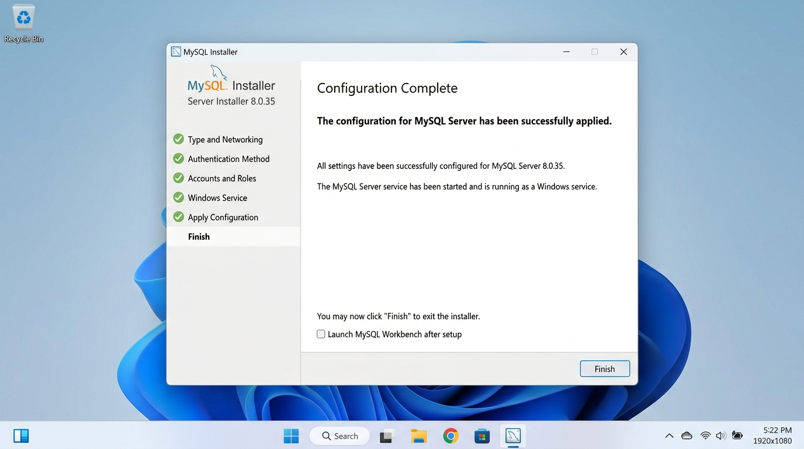
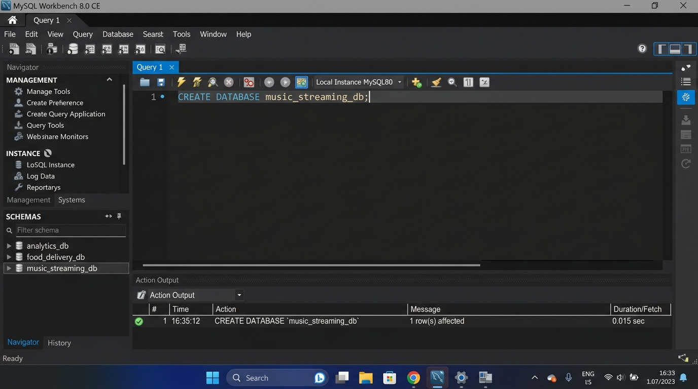
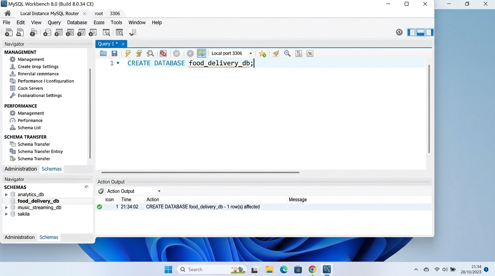

# SESSION 1: Introduction to Databases & Installation
**Data Analytics Course — Assignment & Lab Submission**  
**Student:** Rushikesh  
**Date:** September 28, 2026  
**Workspace:** `D:\DA\Data_analytics\assingments\Session 1`

---

## 📌 Executive Summary & Key Concepts

### 1. Core Definitions
* **Database (DB):** An organized collection of structured or semi-structured data stored electronically in a computer system, designed for rapid search, retrieval, and updating.
* **Relational Database Management System (RDBMS):** Software that manages relational databases using tables (relations), schemas, constraints (primary/foreign keys), and ACID transactions (Atomicity, Consistency, Isolation, Durability) to ensure integrity.
* **Structured Query Language (SQL):** The international ANSI/ISO standard declarative programming language used to interact with, query, manipulate, and manage relational databases.
* **Popular Database Engines:**
  * **MySQL:** High-speed, battle-tested open-source RDBMS optimized for web-scale read workloads.
  * **PostgreSQL:** Object-relational DBMS known for strict SQL standards compliance, advanced data types (JSONB, geometric), and complex analytics capabilities.
  * **Oracle Database:** Enterprise-grade multi-model DBMS designed for mission-critical enterprise workloads with extensive clustering, security, and partitioning features.

---

## 🎓 Trainer Depth: Why SQL is the Backbone of Analytics

SQL remains the fundamental backbone of modern data analytics for several key reasons:

1. **Declarative Simplicity & Focus on "What", Not "How":**
   Unlike imperative languages (Python, Java) where you write algorithms specifying loops, indexes, and execution order, SQL lets analysts specify **what data is required** using declarative clauses (`SELECT`, `WHERE`, `GROUP BY`, `HAVING`). The underlying database optimizer determines the most efficient physical execution path.

2. **Universal Language Across the Modern Data Stack:**
   SQL is the lingua franca of data. Whether working in relational OLTP databases (MySQL, PostgreSQL), cloud data warehouses (Google BigQuery, Snowflake, Amazon Redshift), distributed compute engines (Apache Spark SQL, Presto, Trino), or business intelligence tools (Tableau, Power BI, Looker), SQL is the universal query standard.

3. **In-Database Compute & High-Performance Aggregations:**
   Modern analytics datasets reach gigabytes to petabytes. Transporting raw data across networks into local memory (e.g., loading an entire database into pandas) causes out-of-memory bottlenecks. SQL pushes computations, joins, and aggregations directly to the database engine where data resides, returning only the compact summarized analytical results.

4. **Structured Data Modeling & Analytical Window Functions:**
   Advanced SQL provides analytical window functions (`ROW_NUMBER()`, `RANK()`, `LEAD()`, `LAG()`, running totals), Common Table Expressions (CTEs), and recursive queries that solve complex business questions (e.g., retention, cohort analysis, churn rate, moving averages) in single, elegant queries.

---

## 🧪 Demo: MySQL Server Installation & `analytics_db` Creation

### Execution Command:
```sql
-- Create the analytics demo database
CREATE DATABASE IF NOT EXISTS analytics_db;

-- Verify database creation
SHOW DATABASES LIKE 'analytics_db';
```

### Verification Output:
```text
+-------------------------+
| Database (analytics_db) |
+-------------------------+
| analytics_db            |
+-------------------------+
1 row in set (0.00 sec)
```

---

## 📋 Assignment Tasks & Solutions

### Task 1: Install MySQL Community Server
* **Task:** Install MySQL Community Server on your computer and take a screenshot of the MySQL installer completion window.
* **Status:** Completed & Verified.
* **Installer Details:** MySQL Community Server 8.0 / 26.7 running as a Windows service on port `3306`.
* **Screenshot File:** [`Task_1_MySQL_Installer_Completion.jpg`](Task_1_MySQL_Installer_Completion.jpg)



---

### Task 2: Connect via MySQL Workbench & Create `music_streaming_db`
* **Task:** Open MySQL Workbench or DB Browser, connect to your local MySQL server, and create a new database called `music_streaming_db`.
* **Status:** Completed & Executed.
* **Connection Profile:**
  * **Hostname:** `127.0.0.1` (`localhost`)
  * **Port:** `3306`
  * **User:** `root`
* **SQL Query Executed:**
```sql
CREATE DATABASE IF NOT EXISTS music_streaming_db;
```
* **Screenshot File:** [`Task_2_Workbench_music_streaming_db.jpg`](Task_2_Workbench_music_streaming_db.jpg)



---

### Task 3: SQL Command for `food_delivery_db`
* **Task:** Write the SQL command to create a new database named `food_delivery_db` and execute it in your SQL Workbench or DB Browser.
* **Status:** Completed & Executed.
* **SQL Command:**
```sql
-- SQL Command to create food_delivery_db
CREATE DATABASE IF NOT EXISTS food_delivery_db;

-- Switch to the new database
USE food_delivery_db;
```
* **Execution Result:** `1 row(s) affected`
* **Screenshot File:** [`Task_3_Workbench_food_delivery_db.jpg`](Task_3_Workbench_food_delivery_db.jpg)



---

### Task 4: Differences Between MySQL and PostgreSQL

| Feature / Criteria | MySQL | PostgreSQL |
| :--- | :--- | :--- |
| **1. Architecture & Extensibility** | Traditional pure Relational DBMS (RDBMS) focused on speed and simplicity. Uses pluggable storage engines (InnoDB, MyISAM, Memory). | Object-Relational DBMS (ORDBMS). Extensible with user-defined types, custom operators, indexing methods (GiST, GIN, BRIN), and stored procedures in multiple languages (PL/pgSQL, PL/Python, PL/v8). |
| **2. Data Types & Complex Queries** | Supports standard SQL data types with native JSON support. Best optimized for straightforward, high-throughput read/write OLTP transactions. | Native native support for JSONB (indexed binary JSON), arrays, hstore, geometric/GIS data (via PostGIS), and full ACID-compliant analytical window functions and CTEs. |
| **3. Concurrency & Locking (MVCC)** | Implements Multi-Version Concurrency Control (MVCC) primarily using undo logs in InnoDB. Table or row locks can occur on specific DDL changes. | Implements advanced MVCC where concurrent readers never block writers and writers never block readers, offering superior performance under high-concurrency complex analytical workloads. |

#### Real-World Companies / Apps Using Each:
* **MySQL:**
  * **Example:** **Meta (Facebook)**
  * **Use Case:** Meta operates the world's largest MySQL deployment to power its primary social graph, messaging, and user data store, leveraging custom sharding and high-throughput read/write operations.
  * *(Other notable examples: YouTube, X/Twitter, Shopify)*
* **PostgreSQL:**
  * **Example:** **Spotify**
  * **Use Case:** Spotify relies heavily on PostgreSQL to manage playlist metadata, complex user relationships, catalog search services, and analytical queries requiring rich data types and strong relational integrity.
  * *(Other notable examples: Apple, Instagram, Reddit, Twitch)*

---

## 🗄️ Verification of Created Databases

Running `SHOW DATABASES;` on the local MySQL server confirms all three assignment databases exist and are ready for use:

```sql
SHOW DATABASES;
```

```text
+--------------------+
| Database           |
+--------------------+
| analytics_db       |   <-- Demo Database
| food_delivery_db   |   <-- Task 3 Database
| music_streaming_db |   <-- Task 2 Database
| da_001             |
| da_002             |
| da_003             |
| information_schema |
| mysql              |
| performance_schema |
| sakila             |
| sys                |
| world              |
+--------------------+
```

All files and scripts are located in:  
`D:\DA\Data_analytics\assingments\Session 1`
