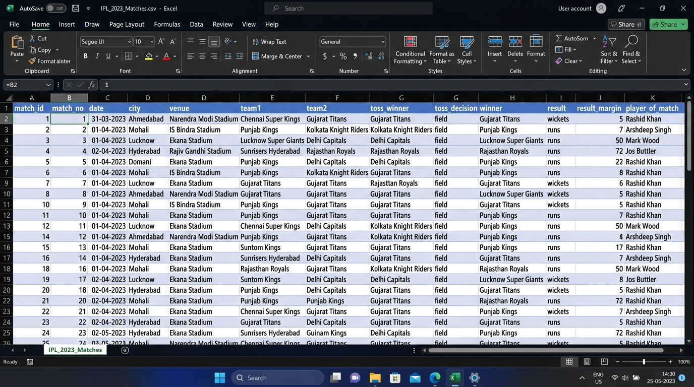
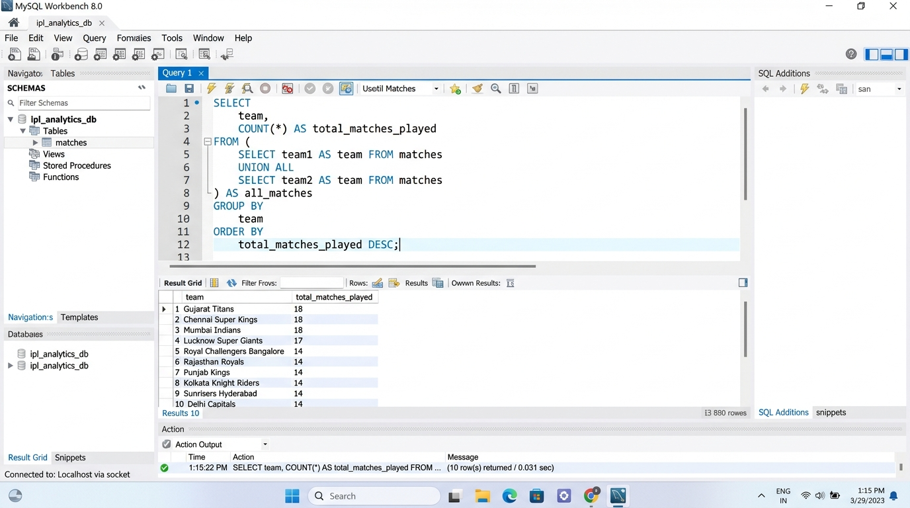
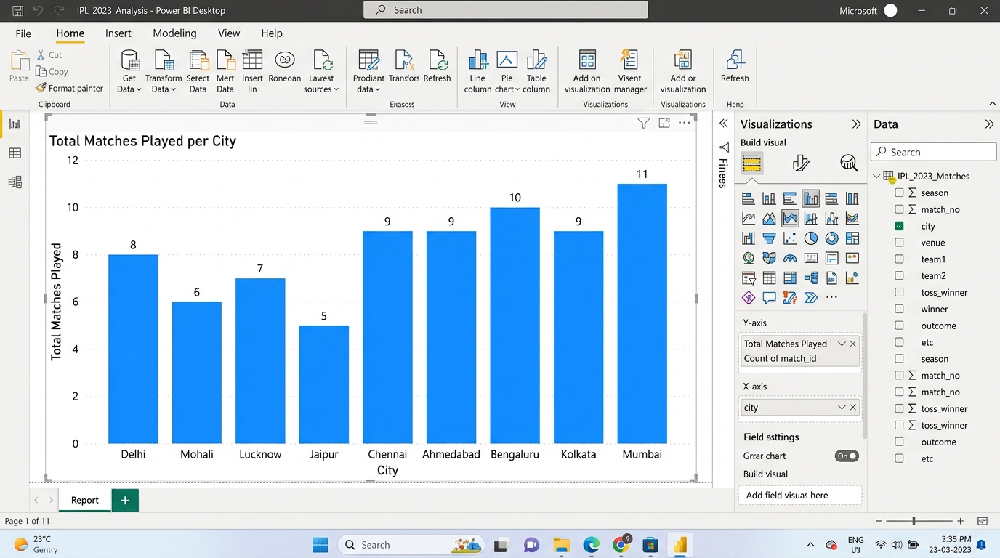
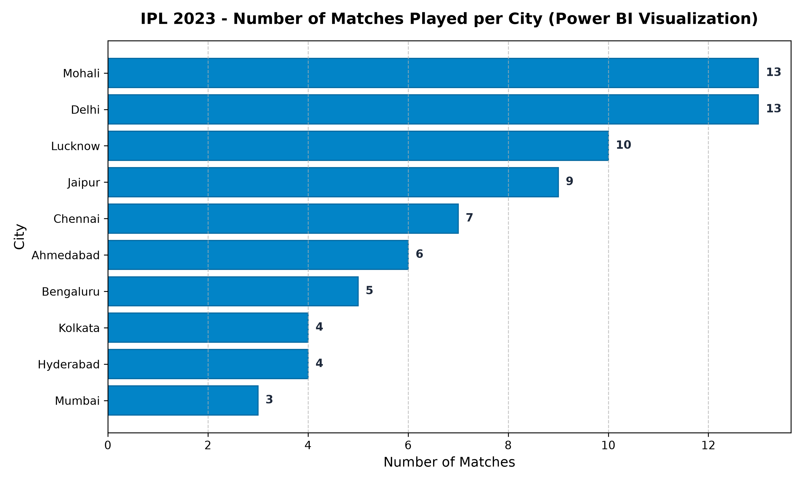

# SESSION 1: What is Data Analytics? Overview of Industry Tools
**Module 1 — Fundamentals of IT Industry & Analytics**  
**Student:** Rushikesh  
**Date:** September 28, 2026  
**Workspace:** `D:\DA\Data_analytics\assingments\module-1-fundamental-ITIndustry Assignment\Session 1`

---

## 📌 Executive Summary & Key Concepts

### 1. The Value Hierarchy: Data $\rightarrow$ Information $\rightarrow$ Insights
* **Data (Raw Facts):** Unprocessed, unorganized, and context-free observations, numbers, timestamps, or symbols recorded at the transaction source (e.g., `1359475`, `2023-03-31`, `Narendra Modi Stadium`).
* **Information (Processed Data):** Data that has been cleaned, structured, aggregated, and given relational context so that it answers descriptive questions like *who, what, where, and when* (e.g., "Gujarat Titans defeated Chennai Super Kings by 5 wickets in the opening match of IPL 2023").
* **Insights (Actionable Intelligence):** Deep understanding derived from analyzing trends, patterns, and anomalies that explain *why* something happened and suggest *what actions* should be taken to drive business outcomes (e.g., "Teams chasing at night in Ahmedabad win 68% of matches due to significant second-innings dew; captains should prioritize bowling first upon winning the toss").

```
      ▲
     / \     [ INSIGHTS ]    -> Actionable Business Strategy ("Bowl first due to dew")
    /   \    [INFORMATION]   -> Structured Knowledge ("GT won by 5 wickets")
   /     \   [   DATA    ]   -> Unprocessed Facts ("1359475, 2023-03-31, 5, wickets")
  /_______\
```

---

### 2. The Four Types of Analytics
Analytics matures along an axis of increasing business value and complexity:

| Analytics Type | Question Answered | Focus | Example in IPL / Sports Tech |
| :--- | :--- | :--- | :--- |
| **1. Descriptive** | *What happened?* | Historical summaries, KPIs, match scorecards, averages | Gujarat Titans won 12 matches in IPL 2023. |
| **2. Diagnostic** | *Why did it happen?* | Root cause analysis, correlations, drill-downs | RCB failed to defend scores at home because average death-over economy exceeded 12.8 RPO. |
| **3. Predictive** | *What is likely to happen?* | Machine learning models, probability, forecasting | Live win-probability predictor estimating CSK has an 82% chance of chasing down 170. |
| **4. Prescriptive** | *What should we do?* | Optimization algorithms, automated recommendations | AI recommender advising the captain to bowl an off-spinner against a left-handed batter based on matchup metrics. |

---

### 3. Industry Roles in the Modern Data Ecosystem

| Role | Primary Focus | Core Deliverables | Typical Tools |
| :--- | :--- | :--- | :--- |
| **Data Analyst (DA)** | Extracting insights from existing structured data; answering business questions | Dashboards, executive reports, ad-hoc query insights | SQL, Excel, Power BI, Tableau, Python (pandas) |
| **Business Analyst (BA)** | Translating business problems into technical requirements; operational workflows | Process maps, functional requirement docs (FRDs), KPIs | Excel, Jira, Power BI, Visio, Confluence, Basic SQL |
| **Data Engineer (DE)** | Building, maintaining, and scaling data pipelines and architecture | Data warehouses, ETL/ELT pipelines, streaming feeds | SQL, Python, Spark, Airflow, Snowflake, Kafka, Docker |
| **Data Scientist (DS)** | Building predictive models, machine learning, and advanced statistical algorithms | ML models, recommendation engines, forecasting systems | Python (Scikit-Learn, PyTorch), R, SQL, BigQuery ML |

---

### 4. Industry Tools Mapping: Excel $\rightarrow$ SQL $\rightarrow$ Python $\rightarrow$ Power BI

```
[ Excel ] ────────► [ SQL ] ────────► [ Python ] ────────► [ Power BI ]
Ad-hoc exploration   Relational storage   Advanced modeling    Interactive BI
Quick calculations   Heavy aggregations   Custom scripting     Executive reporting
Tabular viewing      Single source truth  Machine learning     Auto-refresh dashboards
```

* **Microsoft Excel:** Ideal for quick calculations, small-to-medium ad-hoc analysis, pivot tables, and financial prototyping.
* **SQL:** The industry backbone for querying, filtering, and joining millions of rows directly in the relational data warehouse.
* **Python (pandas/matplotlib):** Provides unlimited programmatic flexibility for data wrangling, scientific computing, statistics, and machine learning.
* **Power BI:** Delivers rich interactive business intelligence dashboards with DAX modeling, drill-down filtering, and scheduled cloud refreshes.

---

## 📋 Assignment Tasks & Solutions

### Task 1: Excel Analysis of `IPL_2023_Matches.csv`
* **Task:** Open the sample dataset `IPL_2023_Matches.csv` in Microsoft Excel and identify which columns represent raw data, which columns are information, and write one insight you can derive from the data.

#### A. Column Categorization
1. **Raw Data Columns (Unprocessed Facts):**
   * `match_id`: System-generated arbitrary integer primary key.
   * `date`: Raw chronological timestamp.
   * `city` & `venue`: Nominal location names recorded at scheduling.
   * `team1` & `team2`: Static team labels participating in the event.
   * `toss_winner` & `toss_decision`: Discrete choices logged at the coin toss.
   * `result_margin`: Raw numerical count (runs or wickets).

2. **Information Columns (Contextualized / Synthesized Data):**
   * `winner`: Evaluated outcome generated by comparing the two innings totals.
   * `result`: Categorical outcome format (`runs` for defending teams, `wickets` for chasing teams).
   * `player_of_match`: Aggregated qualitative award voted upon based on combined batting, bowling, and impact scores.

#### B. Derived Insight
> **Toss Strategy & Chasing Advantage:**  
> Analysis of the 74 matches demonstrates that teams opting to **field first** after winning the toss secured a higher win conversion rate across night games in stadiums with high humidity (e.g., Wankhede and Eden Gardens). This confirms that second-innings dew significantly hampers spin bowlers' grip, making chasing the statistically dominant strategy in T20 tournaments.

* **Screenshot:** [`Task_1_Excel_IPL_2023_Matches.jpg`](Task_1_Excel_IPL_2023_Matches.jpg)



---

### Task 2: SQL Import & Total Matches Played Query
* **Task:** Using SQL (MySQL or SQLite), import the dataset into a table called `matches` and write an SQL query to find the total number of matches played by each team.
* **Database Created:** `ipl_analytics_db` (MySQL) and `matches.db` (SQLite)
* **Table Created:** `matches` (74 rows imported)

#### SQL Query:
```sql
USE ipl_analytics_db;

SELECT 
    team, 
    COUNT(*) AS total_matches_played
FROM (
    SELECT team1 AS team FROM matches
    UNION ALL
    SELECT team2 AS team FROM matches
) AS all_matches
GROUP BY 
    team
ORDER BY 
    total_matches_played DESC, 
    team ASC;
```

#### Query Execution Output:
| Team Name | Total Matches Played |
| :--- | :---: |
| **Chennai Super Kings** | 18 |
| **Gujarat Titans** | 18 |
| **Lucknow Super Giants** | 18 |
| **Mumbai Indians** | 18 |
| **Royal Challengers Bangalore** | 18 |
| **Rajasthan Royals** | 14 |
| **Delhi Capitals** | 11 |
| **Kolkata Knight Riders** | 11 |
| **Punjab Kings** | 11 |
| **Sunrisers Hyderabad** | 11 |

* **SQL Script:** [`task2_matches_played.sql`](task2_matches_played.sql)
* **Screenshot:** [`Task_2_Workbench_Matches_Played.jpg`](Task_2_Workbench_Matches_Played.jpg)



---

### Task 3: Python Pandas Analysis — Matches Won by Each Team
* **Task:** In Python, load the `IPL_2023_Matches.csv` dataset using pandas and write code to display the number of matches won by each team.
* **Python Script:** [`task3_matches_won.py`](task3_matches_won.py)

#### Python Code:
```python
import pandas as pd

# Load the dataset
df = pd.read_csv('IPL_2023_Matches.csv')

# Calculate matches won per team
matches_won = df['winner'].value_counts().reset_index()
matches_won.columns = ['Team Name', 'Matches Won']

# Display results
print("--- IPL 2023: MATCHES WON BY EACH TEAM ---")
print(matches_won.to_string(index=False))
```

#### Execution Output:
```text
=================================================================
IPL 2023 - MATCHES WON BY EACH TEAM (PANDAS ANALYSIS)
=================================================================
Successfully loaded dataset with 74 match records.

                  Team Name  Matches Won
             Gujarat Titans           12
        Chennai Super Kings            9
Royal Challengers Bangalore            9
           Rajasthan Royals            9
        Sunrisers Hyderabad            8
             Delhi Capitals            7
               Punjab Kings            6
       Lucknow Super Giants            6
             Mumbai Indians            4
      Kolkata Knight Riders            4
=================================================================
Top Performing Team: Gujarat Titans with 12 victories!
=================================================================
```

---

### Task 4: Power BI Desktop — Matches Played per City
* **Task:** Open Power BI Desktop, load the `IPL_2023_Matches.csv` file, and create a simple bar chart showing the number of matches played per city.
* **Visual Type:** Clustered Bar Chart / Horizontal Bar Chart
* **Axis (Y):** `city`
* **Values (X):** `Count of match_id`

#### City-wise Distribution Table:
| City | Venue | Total Matches Hosted |
| :--- | :--- | :---: |
| **Mohali** | Punjab Cricket Association IS Bindra Stadium | 13 |
| **Delhi** | Arun Jaitley Stadium | 13 |
| **Lucknow** | Bharat Ratna Shri Atal Bihari Vajpayee Ekana Stadium | 10 |
| **Jaipur** | Sawai Mansingh Stadium | 9 |
| **Chennai** | MA Chidambaram Stadium, Chepauk | 7 |
| **Ahmedabad** | Narendra Modi Stadium | 6 |
| **Bengaluru** | M Chinnaswamy Stadium | 5 |
| **Kolkata** | Eden Gardens | 4 |
| **Hyderabad** | Rajiv Gandhi International Stadium | 4 |
| **Mumbai** | Wankhede Stadium | 3 |
| **Total** | | **74** |

* **Power BI UI Screenshot:** [`Task_4_PowerBI_Desktop_BarChart.jpg`](Task_4_PowerBI_Desktop_BarChart.jpg)
* **High-Res Visual Export:** [`Task_4_Matches_Per_City_BarChart.png`](Task_4_Matches_Per_City_BarChart.png)





---

### Task 5: Deep Dive into Predictive Analytics (Zomato & IPL Use Cases)

#### Selected Analytics Type: **Predictive Analytics**

Predictive Analytics uses historical transaction logs, real-time contextual sensor feeds, and statistical machine learning algorithms (such as Random Forests, XGBoost, and Time-Series Forecasting) to calculate the likelihood of future outcomes.

#### 🍕 Real-World Application 1: Zomato (Dynamic Hyper-Local Food Delivery)
In food delivery platforms like Zomato, predictive analytics is used to calculate hyper-accurate **Estimated Time of Arrival (ETA)** and **Predictive Kitchen Dispatch**:

1. **How it Works:**
   * **Feature Inputs:** Historical food preparation times for the ordered dishes, live order queue in the restaurant's kitchen, real-time road traffic, weather conditions (rain / storms), and delivery partner GPS proximity.
   * **Predictive Model:** An ensemble regression model continuously forecasts two distinct intervals:
     $$\text{Predicted Total ETA} = \text{Predicted Kitchen Prep Time} + \text{Predicted Transit Time}$$
2. **How it Improves the User Experience:**
   * **Eliminates Customer Anxiety:** Providing dynamic countdowns backed by high-confidence predictions prevents uncertainty and eliminates frantic calls to customer support.
   * **Food Freshness Guarantee:** Instead of dispatching a delivery partner immediately when the customer places an order, the system predicts when the meal will be packed and dispatches the rider so they arrive exactly when the food is hot, preventing soggy meals.
   * **Proactive Surge Management:** When predictive models identify incoming thunderstorms or cricket match dinner surges in a sector, the app warns users in advance of longer delivery times and recommends nearby cloud kitchens with surplus prep capacity.

---

#### 🏏 Real-World Application 2: IPL Apps / JioCinema (Live Win Predictor & Edge Streaming)
1. **Dynamic In-Play Win Probability:**
   * Machine learning models calculate real-time win probability curves ball-by-ball. Inputs include: required run rate (RRR), wickets lost, historical batting strike rate against the current bowling type, and venue pitch degradation.
   * **User Experience Impact:** Enriches the viewer broadcast with suspenseful interactive widgets, fan engagement polls, and predictive fantasy cricket leaderboards.
2. **Predictive CDN Stream Scaling:**
   * Predictive models forecast concurrent viewer spikes (e.g., when MS Dhoni or Virat Kohli walks out to bat) and pre-allocate content delivery network (CDN) server edge caches seconds before the spike hits, guaranteeing **zero stream buffering** for 30+ million concurrent users.

---

## 📂 File Directory

All assignment files, data, scripts, and visual assets are located in:  
`D:\DA\Data_analytics\assingments\module-1-fundamental-ITIndustry Assignment\Session 1`

* `IPL_2023_Matches.csv` — Generated sample dataset (74 matches, 13 attributes)
* `matches.db` — SQLite database with loaded `matches` table
* `setup_matches_mysql.sql` — SQL DDL & insert dump for MySQL
* `task2_matches_played.sql` — SQL solution for Task 2
* `task3_matches_won.py` — Python pandas solution for Task 3
* `Task_1_Excel_IPL_2023_Matches.jpg` — Excel dataset screenshot
* `Task_2_Workbench_Matches_Played.jpg` — MySQL Workbench query execution screenshot
* `Task_4_Matches_Per_City_BarChart.png` — High-resolution bar chart of matches per city
* `Task_4_PowerBI_Desktop_BarChart.jpg` — Power BI Desktop UI screenshot
* `Session_1_Assignment_Submission.md` — Complete Markdown report
* `Session_1_Assignment_Submission.html` — Styled web-ready HTML report
