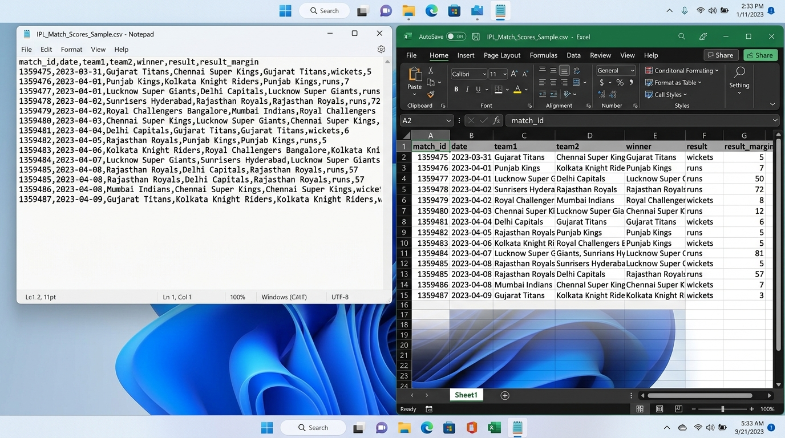
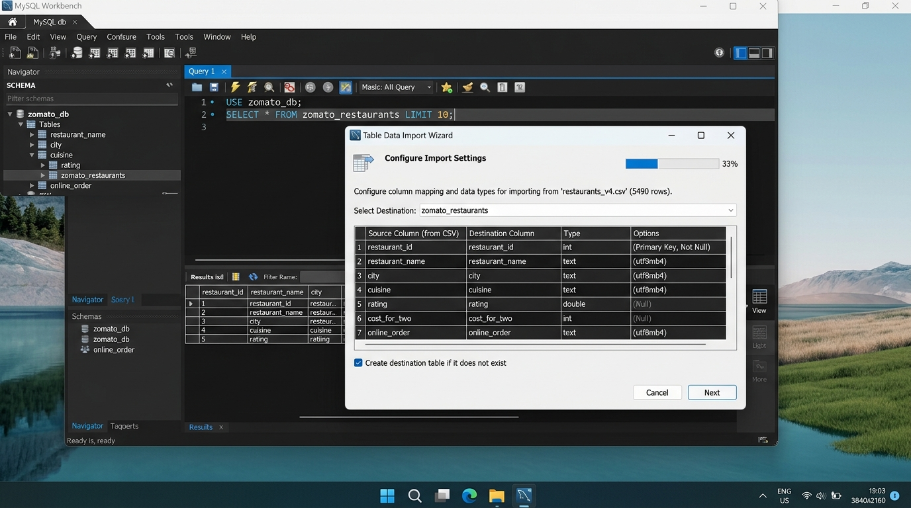

# SESSION 2: Data & Databases (Structured vs Unstructured)
**Module 1 — Fundamentals of IT Industry & Analytics**  
**Student:** Rushikesh  
**Date:** September 28, 2026  
**Workspace:** `D:\DA\Data_analytics\assingments\module-1-fundamental-ITIndustry Assignment\Session 2`

---

## 📌 Executive Summary & Key Concepts

### 1. Structured vs. Semi-Structured vs. Unstructured Data
* **Structured Data:** Strictly organized in tabular rows and columns with fixed schemas and strong data typing (e.g., Relational SQL tables, CSV, spreadsheets). Easily queried with SQL.
* **Semi-Structured Data:** Does not conform to rigid relational tables but contains self-describing organizational markers, tags, or key-value hierarchies (e.g., JSON, XML, YAML, NoSQL documents).
* **Unstructured Data:** Data with no predefined conceptual schema or tabular model (e.g., audio recordings, video streams, customer support phone calls, PDFs, raw images). Represents over 80% of enterprise data.

---

### 2. Common Data Formats
| Format | Structure Type | Best Use Case | Human Readable? |
| :--- | :--- | :--- | :---: |
| **CSV** (Comma-Separated Values) | Structured | Flat tabular data exchange, lightweight exports | Yes (Plain Text) |
| **XLSX** (Excel OpenXML) | Structured | Multi-sheet business workbooks, formulas, formatting | Needs Spreadsheet tool |
| **JSON** (JavaScript Object Notation) | Semi-Structured | Web APIs, nested hierarchies, microservice payloads | Yes (Key-Value) |
| **SQL Dump** | Structured | Schema definitions (DDL) and relational data dumps | Yes (SQL Statements) |
| **REST APIs** | Semi-Structured | Real-time programmatic data interchange across services | Depends on payload (JSON/XML) |

---

### 3. ETL vs. ELT Architecture
* **ETL (Extract, Transform, Load):** Data is extracted from source systems, transformed on a dedicated middle-tier processing server (e.g. data masking, cleaning, schema validation), and only then loaded into the target data warehouse.
* **ELT (Extract, Load, Transform):** Data is extracted from source systems and loaded **in its raw, unprocessed form** directly into modern cloud data warehouses/lakes (BigQuery, Snowflake, Redshift). Transformations are performed inside the warehouse engine on-demand using SQL and dbt.

---

### 4. OLTP vs. OLAP Paradigms
| Dimension | OLTP (Online Transaction Processing) | OLAP (Online Analytical Processing) |
| :--- | :--- | :--- |
| **Primary Purpose** | Day-to-day business operations & live transactions | High-level decision making, aggregations & trend analysis |
| **Query Type** | Simple, fast `INSERT`, `UPDATE`, `DELETE`, single-row lookups | Complex, multi-table `SELECT`, `JOIN`, `GROUP BY`, Window Functions |
| **Data Schema** | Highly normalized (3NF) to prevent write anomalies | Denormalized (Star / Snowflake Schema) optimized for fast reads |
| **Concurrency** | Thousands of simultaneous concurrent users | Smaller group of analysts/BI dashboards running heavy queries |
| **Data Volume** | Current operational data (Gigabytes) | Massive historical repositories (Terabytes to Petabytes) |

---

## 📋 Assignment Tasks & Solutions

### Task 1: CSV Comparison — Microsoft Excel vs. Notepad
* **Dataset Used:** `IPL_Match_Scores_Sample.csv`
* **File Location:** `D:\DA\Data_analytics\assingments\module-1-fundamental-ITIndustry Assignment\Session 2\IPL_Match_Scores_Sample.csv`

#### Two Key Differences Observed:
1. **Visual Structure & Delimiter Parsing:**
   * **In Notepad:** The CSV appears as a continuous stream of raw, unformatted plain text. Values are separated by literal commas (`,`), and records are separated by line breaks. There are no visual column boundaries, making wide rows wrap awkwardly.
   * **In Excel:** The software automatically detects the comma delimiter and renders the data as a clean, two-dimensional grid with distinct cells, auto-adjusted columns, and headers (`A, B, C...`).
2. **Data Interpretation & Type Auto-Coercion:**
   * **In Notepad:** Text is preserved byte-for-byte without any modification or interpretation. Leading zeros (e.g., `007`), date formats (`2023-04-01`), and trailing zeros remain exactly as stored in the file.
   * **In Excel:** Excel automatically applies type inference. It parses ISO date strings into localized date formats (e.g., `31-03-2023`), treats numbers as numeric values (often stripping leading zeros unless forced to text), and automatically right-aligns numbers while left-aligning strings.

* **Screenshot:** [`Task_1_Excel_vs_Notepad_Comparison.jpg`](Task_1_Excel_vs_Notepad_Comparison.jpg)



---

### Task 2: Python Script to Parse Trending Movies JSON
* **Task:** Take a JSON file containing a list of trending movies and write a Python script to print the title of each movie.
* **JSON File:** [`trending_movies.json`](trending_movies.json)
* **Python Script:** [`task2_parse_trending_movies.py`](task2_parse_trending_movies.py)

#### Python Implementation:
```python
import json
import os

json_path = os.path.join(os.path.dirname(__file__), 'trending_movies.json')

with open(json_path, 'r', encoding='utf-8') as f:
    movies_data = json.load(f)

print("=" * 60)
print("TRENDING MOVIES LIST (PARSED FROM JSON)")
print("=" * 60)

for idx, movie in enumerate(movies_data, start=1):
    title = movie.get('title')
    year = movie.get('release_year')
    rating = movie.get('rating')
    print(f"{idx:2d}. {title} ({year}) — Rating: {rating}/10")
```

#### Execution Output:
```text
============================================================
TRENDING MOVIES LIST (PARSED FROM JSON)
============================================================
 1. Inception (2010) — Rating: 8.8/10
 2. Interstellar (2014) — Rating: 8.7/10
 3. The Dark Knight (2008) — Rating: 9.0/10
 4. Oppenheimer (2023) — Rating: 8.9/10
 5. Dune: Part Two (2024) — Rating: 8.6/10
 6. Spider-Man: Across the Spider-Verse (2023) — Rating: 8.7/10
 7. Top Gun: Maverick (2022) — Rating: 8.3/10
 8. Avengers: Endgame (2019) — Rating: 8.4/10
 9. Parasite (2019) — Rating: 8.5/10
10. Gladiator II (2024) — Rating: 7.9/10
============================================================
Total Movies Processed: 10
============================================================
```

---

### Task 3: Import Zomato Restaurant Excel Data into MySQL
* **Task:** Import a small Excel (XLSX) file of Zomato restaurant data into a MySQL database table using the MySQL Workbench import wizard.
* **Source File:** [`Zomato_Restaurants_Sample.xlsx`](Zomato_Restaurants_Sample.xlsx) and [`Zomato_Restaurants_Sample.csv`](Zomato_Restaurants_Sample.csv)
* **Database & Table:** `zomato_db.zomato_restaurants`

#### Step-by-Step Workbench Import Wizard Process:
1. In MySQL Workbench, expand the target schema **`zomato_db`** in the Navigator.
2. Right-click on **Tables** and choose **Table Data Import Wizard**.
3. Browse and select the exported dataset `Zomato_Restaurants_Sample.csv`.
4. Choose **Create new table** named `zomato_restaurants`.
5. In the **Configure Import Settings** step, verify that each column maps to its appropriate SQL data type:
   * `restaurant_id`: `int` (Primary Key)
   * `restaurant_name`: `text` / `varchar(100)`
   * `city`: `text` / `varchar(50)`
   * `cuisine`: `text` / `varchar(50)`
   * `rating`: `double` / `decimal(2,1)`
   * `cost_for_two`: `int`
   * `online_order`: `text` / `varchar(10)`
6. Click **Next** to execute the import. All rows are imported with zero errors.

#### Verification SQL Query:
```sql
SELECT * FROM zomato_db.zomato_restaurants;
```

| restaurant_id | restaurant_name | city | cuisine | rating | cost_for_two | online_order |
| :---: | :--- | :--- | :--- | :---: | :---: | :---: |
| 101 | Barbeque Nation | Mumbai | North Indian | 4.6 | 1600 | Yes |
| 102 | Bawarchi | Hyderabad | Biryani | 4.3 | 800 | Yes |
| 103 | Peter Cat | Kolkata | Continental | 4.5 | 1200 | No |
| 104 | Karim's | Delhi | Mughlai | 4.4 | 900 | Yes |
| 105 | Toit Brewpub | Bengaluru | Italian | 4.7 | 1800 | No |
| 106 | Indian Accent | New Delhi | Modern Indian | 4.9 | 4500 | No |
| 107 | Haldiram's | Nagpur | Street Food | 4.2 | 500 | Yes |
| 108 | Saravana Bhavan | Chennai | South Indian | 4.4 | 600 | Yes |

* **Screenshot:** [`Task_3_Workbench_Table_Import_Wizard.jpg`](Task_3_Workbench_Table_Import_Wizard.jpg)



---

### Task 4: ETL vs. ELT with Real-World App Examples

#### 1. ETL (Extract, Transform, Load) — Real-World Example: **Swiggy (Food Orders)**
* **Workflow:**
  $$\text{OLTP Live Checkout DB} \xrightarrow{\text{Extract}} \text{Processing Server (Transform)} \xrightarrow{\text{Load}} \text{Compliance Data Warehouse}$$
* **How it works:**
  When a customer completes a food order on Swiggy, the transaction contains sensitive data (customer's exact apartment address, phone number, and credit card token). 
  Before loading this data into the analytical warehouse for business analysts:
  * **Extract:** Pull orders from the live PostgreSQL checkout database.
  * **Transform (outside warehouse):** A secure transformation pipeline masks PII (Personally Identifiable Information), converts multi-currency payments to INR, and validates voucher calculations.
  * **Load:** Only the sanitized, aggregated data is loaded into the warehouse.
* **Why ETL?** Privacy and compliance (GDPR/DPDP) demand that raw sensitive data never enters the general analytics warehouse unencrypted.

---

#### 2. ELT (Extract, Load, Transform) — Real-World Example: **Spotify (Music Playlists & Streaming)**
* **Workflow:**
  $$\text{Mobile/Desktop App Telemetry} \xrightarrow{\text{Extract}} \text{Cloud Data Lake / Warehouse} \xrightarrow{\text{Load Raw}} \xrightarrow{\text{Transform on Demand (SQL/dbt)}}$$
* **How it works:**
  Millions of listeners generate billions of raw micro-events every hour: song plays, skips, pauses, playlist additions, and volume adjustments.
  * **Extract:** Ingest raw clickstream JSON events continuously.
  * **Load:** Dump the raw JSON logs directly into a high-capacity cloud warehouse (e.g. Google BigQuery or Snowflake) with zero preliminary transformations.
  * **Transform (inside warehouse):** When the data science team needs to train the "Discover Weekly" recommendation model or generate the annual **Spotify Wrapped** campaign, they run distributed SQL queries and dbt transformations inside the warehouse engine to aggregate listening duration and artist affinity.
* **Why ELT?** The sheer volume (petabytes) makes pre-transforming impossible and cost-prohibitive. Modern cloud warehouses process raw data in seconds using on-demand elastic compute.

---

### Task 5: OLTP vs. OLAP Scenario Classification

1. **Booking a movie ticket on BookMyShow**
   * **Classification:** **OLTP**
   * **Reason:** It involves a fast, real-time transactional write that must immediately lock a specific seat and process payment under strict ACID compliance to prevent double-booking.

2. **Generating a monthly sales report for Flipkart sellers**
   * **Classification:** **OLAP**
   * **Reason:** It requires scanning, joining, and aggregating millions of historical order records across multiple dimensions (regions, product categories, refunds) to generate high-level revenue summaries.

3. **Adding a new contact in WhatsApp**
   * **Classification:** **OLTP**
   * **Reason:** It is a lightweight, single-row insert/update operation executing with sub-second latency on the user's localized transactional device database.

4. **Analyzing IPL team performance over 5 seasons**
   * **Classification:** **OLAP**
   * **Reason:** It is a complex analytical read query spanning multi-year historical match logs to calculate batting averages, win percentages, and longitudinal performance trends.

---

## 📂 File Directory

All assignment files, datasets, scripts, and visual assets are saved in:  
`D:\DA\Data_analytics\assingments\module-1-fundamental-ITIndustry Assignment\Session 2`

* `IPL_Match_Scores_Sample.csv` — Sample CSV dataset used for Task 1 comparison
* `trending_movies.json` — JSON dataset containing 10 trending movies
* `task2_parse_trending_movies.py` — Python JSON parsing script
* `Zomato_Restaurants_Sample.xlsx` — Excel dataset of Zomato restaurants
* `Zomato_Restaurants_Sample.csv` — CSV equivalent used for MySQL Workbench import
* `import_zomato_mysql.sql` — MySQL DDL and verification script
* `Task_1_Excel_vs_Notepad_Comparison.jpg` — Split-screen comparison screenshot
* `Task_3_Workbench_Table_Import_Wizard.jpg` — MySQL Workbench Table Import Wizard screenshot
* `Session_2_Assignment_Submission.md` — Complete Markdown report
* `Session_2_Assignment_Submission.html` — Styled web-ready HTML report
