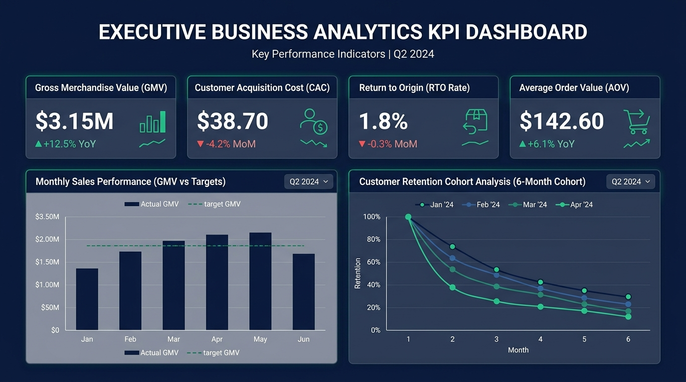

# SESSION 3: Domain Understanding for Analytics
**Module 1 — Fundamentals of IT Industry & Analytics**  
**Student:** Rushikesh  
**Date:** September 28, 2026  
**Workspace:** `D:\DA\Data_analytics\assingments\module-1-fundamental-ITIndustry Assignment\Session 3`

---

## 📌 Executive Summary & Key Concepts

### 1. Why Domain Knowledge Matters in Analytics
Data in isolation consists of mere numbers and character strings. **Domain knowledge** is the contextual lens that transforms raw data into strategic business intelligence. 

Without domain expertise:
* **Misleading Correlations:** An analyst might assume that a sudden dip in order volume indicates poor app performance or ineffective marketing, when it was actually caused by a local cyclone triggering rider safety pauses.
* **Flawed KPI Definitions:** Formulating KPIs that incentivize the wrong behavior (e.g., measuring delivery riders purely on speed rather than safety and order intactness).
* **Inability to Identify Data Anomalies:** Inability to recognize whether an unexpected zero value represents missing data, a system outage, or an expected business condition (e.g., bank branches closed on public holidays).

```
                     ┌────────────────────────┐
                     │   Raw Data & Numbers   │
                     └───────────┬────────────┘
                                 │
                                 ▼
                     ┌────────────────────────┐
                     │   + Domain Knowledge   │ ◄── Business Context & Operations
                     └───────────┬────────────┘
                                 │
                                 ▼
                     ┌────────────────────────┐
                     │ Actionable & Validated │
                     │   Business Insights    │
                     └────────────────────────┘
```

---

### 2. Cross-Domain KPI Examples

| Domain | Key Industry Metrics | What They Measure |
| :--- | :--- | :--- |
| **Retail / E-commerce** | Gross Merchandise Value (GMV), AOV, Cart Abandonment Rate, Return to Origin (RTO) | Total marketplace sales volume, basket size, purchase friction, logistics leakages |
| **FinTech & Banking** | Total Payment Volume (TPV), Net Interest Margin (NIM), NPA Ratio, Take Rate | Transaction throughput, lending profitability, credit default risk, monetization rate |
| **Human Resources** | Employee Turnover Rate, Time to Hire, Cost per Hire, Employee Net Promoter Score (eNPS) | Talent retention, recruitment pipeline velocity, hiring cost efficiency, company culture health |
| **Healthcare** | Bed Occupancy Rate, Average Length of Stay (ALOS), Readmission Rate within 30 Days | Hospital capacity utilization, clinical recovery speed, post-discharge treatment quality |

---

### 3. Demo: Retail Domain KPI Framework

1. **Revenue (Gross vs. Net Revenue):**
   $$\text{Gross Revenue} = \text{Units Sold} \times \text{Selling Price}$$
   $$\text{Net Revenue} = \text{Gross Revenue} - (\text{Discounts} + \text{Returns} + \text{Allowances})$$
2. **Customer Acquisition Cost (CAC):**
   $$\text{CAC} = \frac{\text{Total Sales \& Marketing Expenses}}{\text{Number of New Customers Acquired}}$$
3. **Gross Profit Margin:**
   $$\text{Gross Profit Margin (\%)} = \left(\frac{\text{Net Revenue} - \text{Cost of Goods Sold (COGS)}}{\text{Net Revenue}}\right) \times 100$$
4. **Average Order Value (AOV):**
   $$\text{AOV} = \frac{\text{Total Revenue}}{\text{Total Number of Orders}}$$

* **Executive Visual:** [`Executive_KPI_Dashboard_Visual.jpg`](Executive_KPI_Dashboard_Visual.jpg)



---

## 📋 Assignment Tasks & Solutions

### Task 1: Importance of Domain Understanding (Selected App: Zomato / Food Delivery)

#### Selected Domain: **Zomato (Hyper-Local Food Delivery Marketplace)**

Understanding the hyper-local food delivery domain is paramount before analyzing Zomato’s data because food delivery operates as a complex **three-sided marketplace** comprising **Consumers**, **Restaurant Partners**, and **Delivery Riders**.

#### Why Domain Knowledge is Essential for Zomato Data Analysis:
1. **Multi-Stage Operational Timelines:**  
   An order's lifecycle is split across distinct phases: Order Placement $\rightarrow$ Kitchen Acceptance $\rightarrow$ Kitchen Preparation Time (KPT) $\rightarrow$ Rider Assignment $\rightarrow$ Rider Travel to Restaurant $\rightarrow$ Food Handover $\rightarrow$ Last-Mile Transit $\rightarrow$ Doorstep Handover. An analyst lacking domain context might blame delivery riders for delayed orders, when the bottleneck was actually a restaurant kitchen taking 35 minutes to prepare a complex tandoor dish.
2. **Impact of External Environmental Factors:**  
   Food delivery demand and supply fluctuate wildly based on external shocks:
   * **Weather Conditions:** Sudden monsoon downpours spike customer order demand while simultaneously reducing rider availability and slowing road transit speeds.
   * **Meal Windows & Peak Surges:** Demand is intensely cyclical (12:30 PM–2:30 PM lunch, 7:30 PM–10:30 PM dinner, and late-night weekend spikes). Analyzing daily aggregated averages without hourly time-window slicing leads to misleading conclusions.
3. **Preventing Damaging Interventions:**  
   Without domain knowledge, an analyst might recommend running promotional discount banners for a restaurant that has high conversion rates. However, if that restaurant's kitchen is already running at 100% capacity during peak hours, increasing order volume will cause delayed orders, cold food, angry customers, and long-term brand churn.

---

### Task 2: Flipkart (E-Commerce) — 4 Essential Business KPIs

For an e-commerce giant like Flipkart, the analytics team tracks KPIs across customer growth, financial scale, operational friction, and supply chain efficiency:

#### 1. Gross Merchandise Value (GMV)
* **Definition:** The total monetary sales value of all merchandise sold through the Flipkart marketplace platform over a specific period (e.g., month, quarter, Big Billion Days), prior to deductions for discounts and returns.
* **Formula:** $\text{GMV} = \sum (\text{Item Units Sold} \times \text{Selling Price})$
* **Why it matters:** GMV is the single most critical top-line indicator of marketplace scale, competitive market share versus Amazon, and platform expansion.

#### 2. Repeat Purchase Rate (RPR) / Customer Retention Rate
* **Definition:** The percentage of customers who placed more than one order within a given time frame (e.g., 60 or 90 days).
* **Formula:** $\text{RPR (\%)} = \left(\frac{\text{Number of Customers with } \ge 2 \text{ Orders}}{\text{Total Unique Purchasing Customers}}\right) \times 100$
* **Why it matters:** Acquiring new shoppers is expensive. High repeat purchase rates demonstrate organic customer loyalty, strong brand trust, and healthy lifetime value (LTV).

#### 3. Cart Abandonment Rate (CAR)
* **Definition:** The percentage of initiated shopping carts where a user adds products to their cart but leaves the platform without completing checkout.
* **Formula:** $\text{CAR (\%)} = \left(1 - \frac{\text{Completed Transactions}}{\text{Initiated Shopping Carts}}\right) \times 100$
* **Why it matters:** Highlights friction points in the conversion funnel, such as unexpected shipping fees, lack of preferred payment modes (UPI/EMI), or complex checkout UI steps.

#### 4. Return to Origin (RTO) Rate
* **Definition:** The percentage of shipped orders—particularly Cash on Delivery (COD) orders—that could not be delivered to the customer and are returned back to the seller or fulfillment warehouse.
* **Formula:** $\text{RTO Rate (\%)} = \left(\frac{\text{Total Undelivered / Returned Shipments}}{\text{Total Shipped Orders}}\right) \times 100$
* **Why it matters:** RTO is one of the heaviest cost drains in Indian e-commerce, incurring forward and reverse shipping costs, inventory lock-up, and damaged packaging without generating any revenue.

---

### Task 3: Paytm (Digital Payments) — Customer Acquisition Cost (CAC)

#### A. Definition of Customer Acquisition Cost (CAC) in FinTech:
In the digital payments and fintech domain, **Customer Acquisition Cost (CAC)** represents the average investment required to convince a prospective consumer or merchant to download the Paytm app, complete KYC verification, and execute their first financial transaction (e.g., UPI payment, bill pay, wallet reload, or soundbox QR activation).

$$\text{CAC} = \frac{\text{Total Marketing, Advertising, Promotional Cashback \& Onboarding Expenses}}{\text{Total Number of New Transacting Users Acquired}}$$

---

#### B. Real-World Paytm Campaign Calculation Example:

Suppose Paytm launches a festive quarterly merchant and consumer acquisition campaign across Tier-2 and Tier-3 cities in India:

#### 1. Expenses Incurred (Q3 Campaign):
* **Digital Performance Ads (Google, Meta, YouTube):** ₹35,00,000
* **Promotional User Incentives (₹50 cashback on 1st UPI transaction):** ₹25,00,000
* **Field Sales Team & Offline Merchant QR/Soundbox Distribution:** ₹20,00,000
* **Brand Sponsorships & TV Campaigns:** ₹20,00,000
* **Total Acquisition Spend:** $\mathbf{₹1,00,00,000} \text{ (₹1 Crore)}$

#### 2. Acquisition Output:
* Through this campaign, **200,000** first-time users successfully registered and completed their first qualifying financial transaction.

#### 3. CAC Calculation:
$$\text{CAC} = \frac{₹1,00,00,000}{200,000 \text{ New Transacting Users}} = \mathbf{₹50 \text{ per acquired customer}}$$

#### Analytical Business Implication:
Paytm’s monetization model yields modest transaction fees (MDR) on UPI but earns substantial margins on financial services (micro-loans, insurance, mutual funds, merchant soundbox subscriptions). If the **Customer Lifetime Value (LTV)** of an active Paytm user averages ₹350 over two years, an acquisition cost of ₹50 yields a highly profitable **LTV:CAC ratio of $7:1$**, confirming the campaign's commercial viability.

---

### Task 4: Designing a New Customer Satisfaction Metric for Swiggy

#### Proposed Metric: **Promise Gap Score (PGS) / Perfect Order Fulfillment Index (POFI)**

#### Analytical Rationale:
Traditional financial metrics (Revenue, Gross Order Value, Average Order Value) track transactional scale but completely hide customer frustration. A customer who orders a ₹1,200 dinner that arrives **25 minutes late, with lukewarm food and missing beverages**, generated high revenue for Swiggy but has an exceptionally high likelihood of churning to Zomato.

To address this, we define the **Promise Gap Score (PGS)**:

$$\text{PGS (\%)} = \left(\frac{\text{Orders Delivered on or before Promised ETA with 100\% Item Accuracy \& Uncompromised Packaging}}{\text{Total Delivered Orders}}\right) \times 100$$

#### How This Metric is Identified and Defined:
1. **Data Telemetry Fusion:** Combine data from four distinct event streams:
   * **ETA Variance:** Difference between promised delivery timestamp shown at checkout ($\text{ETA}_{\text{promised}}$) and the actual delivery doorstep timestamp ($\text{ETA}_{\text{actual}}$).
   * **Order Completeness:** Verification that zero customer support tickets or refund requests were raised for missing or incorrect items.
   * **Packaging Integrity:** Post-delivery customer feedback rating for packaging (temperature, spill-free seals).
2. **Categorization Rules:**
   * An order qualifies as **"Perfect Fulfillment" (PGS = 1)** only if $\text{ETA}_{\text{actual}} \le \text{ETA}_{\text{promised}} + 3\text{ minutes}$, with zero missing items, and packaging rating $\ge 4/5$.
3. **Operational Impact on Customer Satisfaction:**
   * **Granular Kitchen Diagnostics:** Pinpoints restaurants that consistently cause packaging errors or prep delays, enabling Swiggy to enforce packaging standards or increase buffer prep times.
   * **Rider Route Optimization:** Identifies geographic micro-clusters where traffic bottlenecks cause high promise gaps, triggering hyper-local algorithm re-tuning.
   * **Proactive Recovery:** If an order registers a negative Promise Gap during transit (predicted delay $>15$ mins), Swiggy's CRM can automatically issue an instant apologies notification and ₹50 Swiggy Money wallet credit **before** the customer even opens the support chat, converting a potential churn event into a moment of brand loyalty.

---

## 📂 File Directory

All assignment files and visual assets are located in:  
`D:\DA\Data_analytics\assingments\module-1-fundamental-ITIndustry Assignment\Session 3`

* `Executive_KPI_Dashboard_Visual.jpg` — Executive Business Analytics KPI Dashboard
* `Session_3_Assignment_Submission.md` — Complete Markdown submission report
* `Session_3_Assignment_Submission.html` — Web-ready styled HTML report
