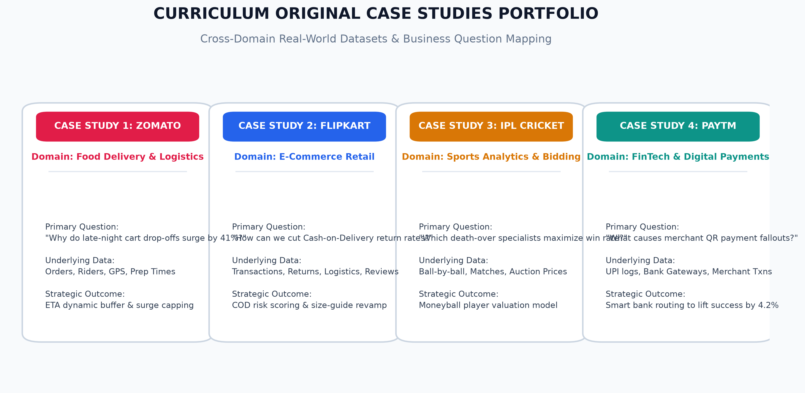
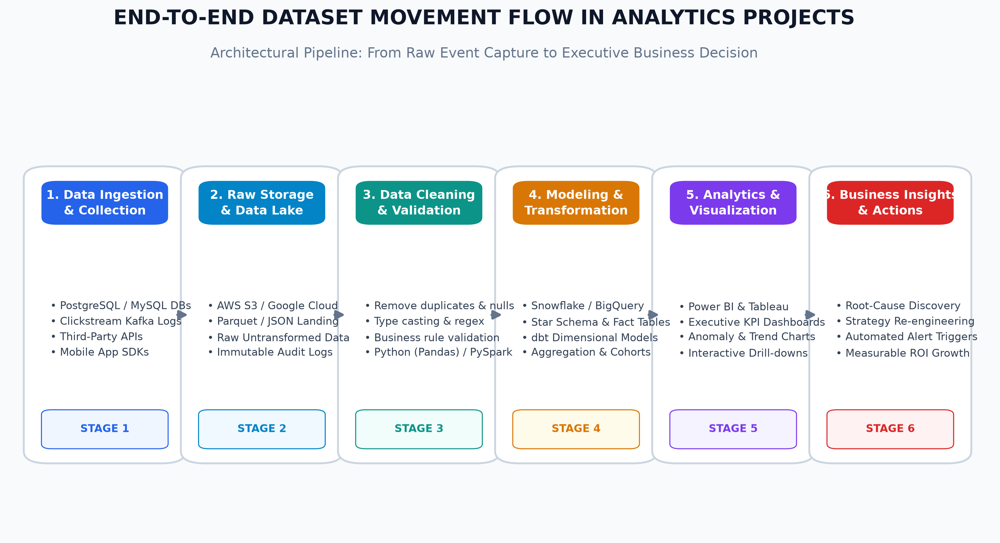

# Module 1: Fundamentals of IT & Industry Analytics
## Session 6: Case Study Orientation & Data Pipeline Architecture

---

### Executive Overview & Program Orientation

Modern data analytics is not an isolated academic exercise—it is the operational nervous system of digital enterprises. This session provides a holistic orientation to the **Original Case Studies Portfolio**, outlines the **End-to-End Dataset Movement Pipeline**, and establishes the roadmap for subsequent curriculum modules (Advanced Excel, SQL Databases, Python for Data Science, and Power BI / Tableau).



#### The Curriculum Case Studies Portfolio:

| Case Study # | Domain & Industry | Anchor Enterprise | Core Analytical Focus | Primary Dataset Architecture |
| :---: | :--- | :--- | :--- | :--- |
| **Case Study 1 (Demo)** | On-Demand Food Logistics | **Zomato / Swiggy** | Cart abandonment, late-night surges, delivery SLA, rider fleet utilization. | Checkout session logs, GPS telemetry, restaurant prep times, order items. |
| **Case Study 2** | Retail E-Commerce | **Flipkart** | Return-to-Origin (RTO) reduction, discount elasticity, category margins, customer churn. | Orders fact table, returns log, customer demographic profiles, catalog metadata. |
| **Case Study 3** | Sports & Auction Analytics | **IPL Cricket** | Player performance valuation, death-overs impact, venue scoring dynamics, Moneyball squad selection. | Ball-by-ball delivery records, match outcomes, player auction valuations, pitch statistics. |
| **Case Study 4** | FinTech & Digital Payments | **Paytm** | UPI transaction drop-offs, gateway latency, merchant QR churn, fraud anomaly detection. | Transaction logs, banking gateway response codes, merchant terminal telemetry. |

---

### Demo: Case Studies Walkthrough (Business Questions & Expected Outcomes)

```
[Business Problem Identification] ──> [Data Sourcing] ──> [Analytical Modeling] ──> [Measurable ROI Action]
```

#### Demo Case: *Zomato Fleet Optimization & Cart Abandonment*
* **Core Business Question**: *"Why are high-intent users dropping off during late-night checkout (11 PM - 4 AM), and how can we recover Rs. 4.5M in lost weekly Gross Merchandise Value (GMV)?"*
* **Analytical Modeling**: Logistic regression and cohort segmentation on checkout drop-offs against delivery fees and estimated times of arrival (ETAs).
* **Expected Outcome**: Identified that surge fees $> \text{Rs. } 65$ and $\text{ETAs} > 48\text{ min}$ drove 68% of drop-offs. Implemented an operational shift bonus for night riders ($\text{Rs. } 30/\text{order}$) and capped consumer surge pricing at Rs. 40, recovering 29% of abandoned carts within 21 days.

---

### Task 1: Case Study Analysis — Flipkart E-Commerce Returns & Customer Retention

#### Selected Case Study: **Flipkart (E-Commerce Retail)**

For an e-commerce giant processing millions of orders daily, product returns and high-cost logistics represent significant threats to profitability. Analyzing the underlying transactional data allows the analytics team to answer critical strategic questions:

#### Three Key Business Questions:

1. **Question 1: Cash-on-Delivery (COD) vs. Prepaid Return-to-Origin (RTO) Disparity**
   > *"What is the exact correlation between payment method (Cash on Delivery vs. UPI/Prepaid) and Return-to-Origin (RTO) rates across product categories, and how much margin is lost due to unfulfilled COD deliveries in Tier-2 and Tier-3 cities?"*
   * **Why it matters**: COD orders historically experience 3x higher refusal rates at the customer doorstep than prepaid transactions, incurring reverse logistics costs without generating revenue.

2. **Question 2: Discount Elasticity vs. Return Propensity in Fashion**
   > *"Does deep discounting (> 40% off) in the Fashion & Apparel category attract low-intent 'serial returners' who order multiple sizes with the premeditated intent to return, and what is the net profit per customer after accounting for reverse logistics?"*
   * **Why it matters**: Topline revenue growth can be deceptive if high gross sales are negated by a 35% apparel return rate and reverse shipping expenses.

3. **Question 3: Customer Satisfaction & Rating Threshold as a Churn Predictor**
   > *"At what customer rating threshold (e.g., average review rating < 3.2 stars) or delivery delay threshold (> 48 hours past promised date) does a customer's 90-day repurchase probability drop below 15%, and which automated intervention (coupons, priority support) best mitigates churn?"*
   * **Why it matters**: Identifying early warning indicators allows the CRM team to proactively intervene before a customer switches to Amazon or Meesho.

---

### Task 2: Dataset Flow Architecture (Raw Collection to Insights)

#### Accompanying Dataset:
* **CSV File**: [`Flipkart_Orders_Returns_Dataset.csv`](Flipkart_Orders_Returns_Dataset.csv)
* **Excel Workbook**: [`Flipkart_Orders_Returns_Dataset.xlsx`](Flipkart_Orders_Returns_Dataset.xlsx)
* **Dataset Scope**: 250 transactional orders containing `Order_ID`, `Customer_ID`, `Category`, `City`, `Order_Value_INR`, `Discount_Applied_INR`, `Payment_Method`, `Is_Returned`, `Return_Reason`, and `Customer_Rating`.

#### Pipeline Flow Diagram:


#### Detailed Explanation of the 6 Data Flow Stages:

```
[1. Ingestion] ──> [2. Data Lake] ──> [3. Cleaning] ──> [4. Data Warehouse] ──> [5. BI & Reporting] ──> [6. Business Action]
```

1. **Stage 1: Data Ingestion & Event Capture**:
   - Web & Mobile SDKs capture client-side clickstream events (impressions, clicks, add-to-cart).
   - Microservices stream transaction confirmations and inventory updates through **Apache Kafka** or AWS Kinesis.
   - Transactional relational databases (**PostgreSQL / MySQL**) log order records.
2. **Stage 2: Raw Storage & Data Lake Landing**:
   - Unprocessed data lands into cloud object storage (**Amazon S3** or **Google Cloud Storage**) in JSON or Parquet formats.
   - Acts as an immutable historical record allowing auditability and re-processing.
3. **Stage 3: Data Cleaning & Preprocessing**:
   - Batch and streaming processing engines (**Python Pandas / PySpark / AWS Glue**) strip whitespace, impute missing values, standardize datetime formats to UTC, and deduplicate network retries.
4. **Stage 4: Modeling & Data Warehousing**:
   - Cleaned tables are ingested into analytical enterprise data warehouses (**Snowflake / Google BigQuery / Amazon Redshift**).
   - Data is organized into dimensional schemas (Star Schema: `Fact_Orders` linked to `Dim_Customer`, `Dim_Product`, `Dim_Date`) using **dbt** (data build tool).
5. **Stage 5: Analytics, BI & Visualization**:
   - Business intelligence engines (**Microsoft Power BI / Tableau**) connect directly to warehouse marts.
   - Real-time KPI dashboards track sales conversion, RTO heatmaps, and profit margins.
6. **Stage 6: Strategic Insights & Automated Business Action**:
   - Machine learning inference pipelines score live transactions for fraud or high RTO risk.
   - Executives and category managers adjust discount pricing, blacklist fraudulent delivery addresses, or update size recommendation guides.

---

### Task 3: Expected Business Outcomes & Decision-Making Impact

For the **Flipkart E-Commerce Order Returns Case Study**, the executive leadership team seeks concrete, actionable deliverables:

#### Key Expected Outcomes:
1. **RTO Risk Scorecard**: An algorithmic model flagging high-risk Cash-on-Delivery orders before dispatch based on customer history, delivery pincode, and order value.
2. **Category Return Diagnostics Matrix**: A breakdown pinpointing specific SKUs with return rates exceeding 25% due to sizing discrepancies or misleading product images.
3. **Customer Cohort Retention Curve**: A clear visualization tracking 30-day, 60-day, and 90-day repeat purchasing frequency segmented by acquisition channel.

#### How These Outcomes Drive Strategic Decision-Making:
> *"By implementing automated RTO risk scoring, Flipkart can selectively mandate UPI prepayments or nominal Rs. 49 shipping deposits for high-risk delivery clusters, directly cutting reverse logistics expenses by an estimated **Rs. 18.5M quarterly**. Simultaneously, identifying apparel items with recurring 'Size/Fit Issues' allows category teams to replace static sizing charts with 3D interactive size recommendation widgets, boosting net retained sales by 12% without increasing ad spend."*

---

### Task 4: Swiggy Data Analyst Scenario (Real-World Case)

#### Scenario Overview:
* **Role**: Lead Operations & Logistics Data Analyst at **Swiggy**.
* **Operational Challenge**: Customer ratings in Bangalore's Koramangala and Indiranagar hubs have dropped due to prolonged delivery times during peak lunch hours (12:30 PM – 2:30 PM). Restaurant partners claim delivery partners arrive too late, while delivery partners claim they spend 12–18 minutes waiting idly outside restaurant kitchens for food preparation to finish.

#### 1. Targeted Business Question:
> *"How can Swiggy reduce delivery partner idle wait times at restaurant partner kitchens from 11.4 minutes to under 4.0 minutes during peak lunch hours in East Bangalore, without increasing food spoilage or missing the 30-minute delivery SLA?"*

#### 2. Specific Dataset Required:

| Data Attribute | Source System | Analytical Purpose |
| :--- | :--- | :--- |
| `order_id` & `order_timestamp` | App Order Service | Baseline timeline start. |
| `restaurant_id` & `cuisine_type` | Merchant Database | Differentiates fast-prep items (burgers: 7 min) from slow-prep items (dum biryani: 22 min). |
| `kitchen_prep_start_time` | Merchant Kitchen Display (KDS) | Confirms when kitchen staff actually started cooking. |
| `kitchen_food_ready_timestamp` | Merchant App ("Food Ready" button) | Validates actual dish preparation duration. |
| `rider_id` & `rider_dispatch_timestamp` | Fleet Assignment Engine | Measures when the dispatch system assigned the order. |
| `rider_arrival_at_restaurant_timestamp` | Rider GPS Geofence (100m radius) | Marks the exact moment the delivery partner reaches the venue. |
| `rider_handover_timestamp` | QR Code Scan at Restaurant Counter | Measures exact handover completion. |
| `idle_wait_duration_minutes` | Calculated (`Handover` - `Arrival`) | Core metric to optimize. |
| `customer_delivery_timestamp` & `rating` | Consumer App Service | Evaluates end-to-end SLA adherence and customer NPS. |

#### 3. Expected Outcome & Business Impact:
* **Algorithmic Solution**: Transition from static dispatch (assigning the nearest rider immediately when the order is placed) to a **Dynamic Just-In-Time (JIT) Predictive Dispatch Model**. The dispatch system factors in historical kitchen prep time for the specific dish and merchant velocity, only dispatching the delivery partner when food preparation is within 4 minutes of completion.
* **Measurable Business Impact**:
  - Reduces average rider wait time from **11.4 minutes to 3.8 minutes** (a **66% reduction**).
  - Enables each delivery partner to complete an additional **1.8 orders per shift**, increasing rider earnings by Rs. 140/day.
  - Boosts Swiggy's peak order fulfillment capacity by **19%** without hiring additional gig workers, saving **Rs. 7.2M in monthly fleet subsidies**.

---

### Deliverable Inventory (Session 6)

All resources and reports have been generated and validated in:  
`D:\DA\Data_analytics\assingments\module-1-fundamental-ITIndustry Assignment\Session 6`

| Artifact Name | Description | Status |
| :--- | :--- | :--- |
| `Flipkart_Orders_Returns_Dataset.csv` | 250-record sample dataset for e-commerce return analytics | Verified |
| `Flipkart_Orders_Returns_Dataset.xlsx` | Formatted Excel workbook containing the e-commerce orders & returns data | Verified |
| `prepare_session6_assets.py` | Python script generating dataset, data pipeline diagram, and case study visual | Verified |
| `Data_Pipeline_Flow_Diagram.png` | 300 DPI high-definition flowchart of the 6-stage analytics data movement pipeline | Verified |
| `Case_Studies_Portfolio_Overview.png` | 300 DPI high-definition card layout of the 4 curriculum case studies | Verified |
| `Session_6_Assignment_Submission.md` | Master technical documentation covering all 4 tasks and curriculum orientation | Verified |
| `Session_6_Assignment_Submission.html` | Presentation-ready HTML document | In Progress |
