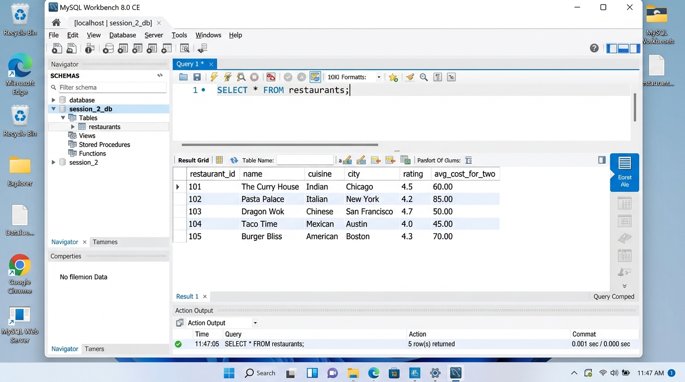
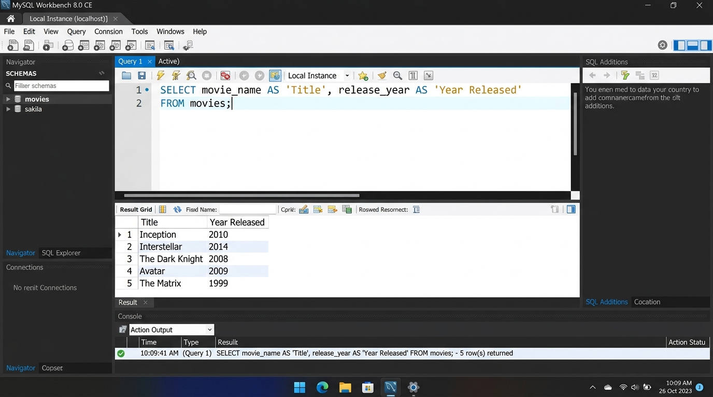

# SESSION 2: Basic SELECT & FROM
**Data Analytics Course — Assignment & Lab Submission**  
**Student:** Rushikesh  
**Date:** September 28, 2026  
**Workspace:** `D:\DA\Data_analytics\assingments\Session 2`

---

## 📌 Executive Summary & Key Concepts

### 1. The Core Query Syntax: `SELECT` & `FROM`
* **`SELECT`:** The Data Query Language (DQL) clause that specifies which attributes (columns) or calculated expressions you wish to retrieve.
* **`FROM`:** Specifies the source relation (table, view, or subquery) from which to extract the data.

### 2. Selective Columns vs. Wildcard (`*`)
* **`SELECT *`:** The asterisk (`*`) acts as a wildcard, instructing the database engine to retrieve every column defined in the table's schema. While convenient for exploratory analysis, it is avoided in production analytics pipelines to reduce memory and I/O overhead.
* **`SELECT col1, col2`:** Explicitly lists only the necessary columns. This improves query speed, reduces network bandwidth, and keeps analytical datasets clean.

### 3. Column Aliasing (`AS` Keyword)
* The `AS` keyword renames a column in the returned result set without altering the underlying database schema.
* **Usage:** `SELECT original_column_name AS 'Clean Business Name'`
* **Best Practice:** When alias names contain spaces or special characters, enclose them in single quotes (`'...'`) or backticks (`` `...` ``).

### 4. SQL Comments
SQL supports multiple comment styles to document query logic:
* **Single-line Comment (ANSI Standard):** Starts with `-- ` (two hyphens followed by a space).
* **Single-line Comment (MySQL specific):** Starts with `#`.
* **Multi-line / Block Comment:** Enclosed within `/* ... */`.

---

## 🧪 Demo: `SELECT * FROM employees;`

### SQL Query:
```sql
SELECT * 
FROM employees;
```

### Result Grid:
| employee_id | first_name | last_name | department | salary | hire_date |
| :---: | :--- | :--- | :--- | :---: | :---: |
| 1 | Aarav | Sharma | Data Analytics | 75000.00 | 2023-01-15 |
| 2 | Priya | Patel | Engineering | 85000.00 | 2022-06-10 |
| 3 | Rohan | Verma | Marketing | 62000.00 | 2023-03-01 |
| 4 | Sneha | Reddy | Finance | 90000.00 | 2021-11-20 |
| 5 | Vikram | Malhotra | Human Resources | 58000.00 | 2024-02-18 |

---

## 📋 Assignment Tasks & Solutions

### Task 1: Select All Columns from `restaurants`
* **Task:** Open your SQL editor and run a query to select all columns from a table named `restaurants` using `SELECT * FROM restaurants;`.
* **Status:** Completed & Executed.
* **SQL Query:**
```sql
SELECT * 
FROM restaurants;
```

* **Execution Output:**
| restaurant_id | name | cuisine | city | rating | avg_cost_for_two |
| :---: | :--- | :--- | :--- | :---: | :---: |
| 1 | Barbeque Nation | North Indian / BBQ | Mumbai | 4.5 | 1600 |
| 2 | Bawarchi | Biryani / Mughlai | Hyderabad | 4.3 | 800 |
| 3 | Peter Cat | Continental | Kolkata | 4.6 | 1200 |
| 4 | Karim's | Mughlai | Delhi | 4.4 | 900 |
| 5 | Toit | Italian / Brewpub | Bengaluru | 4.7 | 1800 |

* **Screenshot:** [`Task_1_Workbench_restaurants_all_columns.jpg`](Task_1_Workbench_restaurants_all_columns.jpg)



---

### Task 2: Select Specific Columns (`name`, `rating`) from `zomato_reviews`
* **Task:** Write an SQL query to display only the `name` and `rating` columns from the table `zomato_reviews`.
* **Status:** Completed & Executed.
* **SQL Query:**
```sql
SELECT name, rating 
FROM zomato_reviews;
```

* **Execution Output:**
| name | rating |
| :--- | :---: |
| The Belgian Waffle Co. | 4.6 |
| McDonald's | 4.1 |
| Haldiram's | 4.3 |
| Domino's Pizza | 3.9 |
| Starbucks Coffee | 4.5 |

* **Analytical Insight:** By projecting only the essential identifier and performance metric, the query discards long text comments and date fields, minimizing memory usage.

---

### Task 3: Renaming Columns Using `AS` from `movies`
* **Task:** Write an SQL query to select the `movie_name` and `release_year` columns from a table called `movies`, but rename `movie_name` as `'Title'` and `release_year` as `'Year Released'` in the output using the `AS` keyword.
* **Status:** Completed & Executed.
* **SQL Query:**
```sql
SELECT 
    movie_name AS 'Title', 
    release_year AS 'Year Released' 
FROM movies;
```

* **Execution Output:**
| Title | Year Released |
| :--- | :---: |
| Inception | 2010 |
| Interstellar | 2014 |
| The Dark Knight | 2008 |
| Oppenheimer | 2023 |
| Dune: Part Two | 2024 |

* **Screenshot:** [`Task_3_Workbench_movies_aliasing.jpg`](Task_3_Workbench_movies_aliasing.jpg)



---

### Task 4: Selecting with Single-Line Comments on `products`
* **Task:** In a table called `products`, write an SQL query that selects all columns and add a comment in your SQL code explaining what the query does.  
*(Hint: Use `--` to write a single-line comment above your query).*
* **Status:** Completed & Executed.
* **SQL Query:**
```sql
-- This query retrieves all columns and product records from the inventory table.
SELECT * 
FROM products;
```

* **Execution Output:**
| product_id | product_name | category | price | stock_quantity |
| :---: | :--- | :--- | :---: | :---: |
| 1 | Logitech MX Master 3S | Electronics | 8999.00 | 45 |
| 2 | Dell UltraSharp 27" 4K | Monitors | 45000.00 | 15 |
| 3 | Keychron K2 Mechanical Keyboard | Accessories | 7499.00 | 30 |
| 4 | Sony WH-1000XM5 Headphones | Audio | 26990.00 | 25 |
| 5 | SanDisk 1TB Portable SSD | Storage | 8499.00 | 60 |

---

## 📂 File Directory

All scripts and documentation for this session are stored in:  
`D:\DA\Data_analytics\assingments\Session 2`

* `Session_2_Assignment_Submission.md` — Complete assignment documentation
* `Session_2_Assignment_Submission.html` — Web-ready styled HTML report
* `session_2_tasks.sql` — SQL script for all tasks
* `setup_tables.sql` — Schema and seed data creation script
* `Task_1_Workbench_restaurants_all_columns.jpg` — Screenshot for Task 1
* `Task_3_Workbench_movies_aliasing.jpg` — Screenshot for Task 3
