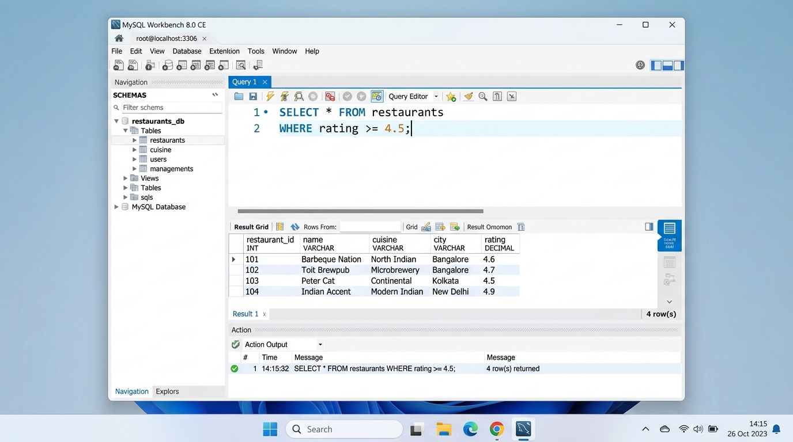
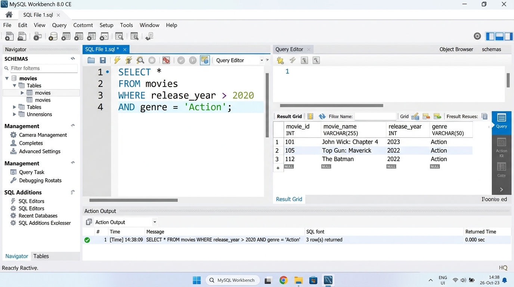

# SESSION 3: WHERE Clause & Operators
**Data Analytics Course — Assignment & Lab Submission**  
**Student:** Rushikesh  
**Date:** September 28, 2026  
**Workspace:** `D:\DA\Data_analytics\assingments\Session 3`

---

## 📌 Executive Summary & Key Concepts

### 1. The Role of the `WHERE` Clause
The `WHERE` clause filters rows extracted by the `FROM` clause. Only records that evaluate to **TRUE** for the given search condition are included in the final result set. Records evaluating to **FALSE** or **UNKNOWN** (due to `NULL` values) are excluded.

### 2. Comparison Operators
| Operator | Description | Example |
| :---: | :--- | :--- |
| `=` | Equal to | `department = 'IT'` |
| `<>` or `!=` | Not equal to | `category <> 'Electronics'` |
| `>` | Strictly greater than | `release_year > 2020` |
| `<` | Strictly less than | `price < 500` |
| `>=` | Greater than or equal to | `rating >= 4.5` |
| `<=` | Less than or equal to | `salary <= 50000` |

### 3. Logical Operators & Operator Precedence
* **`AND`:** Evaluates to TRUE only if **both** surrounding conditions are TRUE.
* **`OR`:** Evaluates to TRUE if **at least one** condition is TRUE.
* **`NOT`:** Negates the truth value of a Boolean expression (`TRUE` becomes `FALSE`, `FALSE` becomes `TRUE`).

#### Operator Precedence:
$$\text{Parentheses } () \implies \text{NOT} \implies \text{AND} \implies \text{OR}$$

> [!IMPORTANT]
> Because `AND` has higher precedence than `OR`, complex queries combining both operators should always use parentheses `()` to avoid unexpected logical evaluation.

---

## 🧪 Demo: Filter Employees (`salary > 50000 AND department = 'IT'`)

### SQL Query:
```sql
SELECT * 
FROM employees
WHERE salary > 50000 
  AND department = 'IT';
```

### Result Grid:
| employee_id | first_name | last_name | department | salary |
| :---: | :--- | :--- | :---: | :---: |
| 1 | Rohan | Sharma | IT | 75000.00 |
| 3 | Amit | Patel | IT | 82000.00 |
| 6 | Kavita | Iyer | IT | 52000.00 |

* **Analysis:** Records with `salary <= 50000` (e.g. Neha Verma, 45000) or non-IT departments (Pooja Singh in Finance, Vikas Joshi in Marketing) were correctly excluded because `AND` requires both criteria to evaluate to `TRUE`.

---

## 📋 Assignment Tasks & Solutions

### Task 1: Select Restaurants with Rating $\ge 4.5$
* **Task:** Write an SQL query to select all restaurants from a table named `restaurants` where the rating is greater than or equal to 4.5.
* **Status:** Completed & Executed.
* **SQL Query:**
```sql
SELECT * 
FROM restaurants
WHERE rating >= 4.5;
```

* **Execution Output:**
| restaurant_id | name | cuisine | city | rating |
| :---: | :--- | :--- | :--- | :---: |
| 1 | Barbeque Nation | North Indian / BBQ | Mumbai | 4.6 |
| 3 | Toit Brewpub | Italian / Craft Beer | Bengaluru | 4.7 |
| 5 | Peter Cat | Continental | Kolkata | 4.5 |
| 7 | Indian Accent | Modern Indian | New Delhi | 4.9 |

* **Screenshot:** [`Task_1_Workbench_restaurants_rating_filter.jpg`](Task_1_Workbench_restaurants_rating_filter.jpg)



---

### Task 2: Filter Movies Released After 2020 and Genre 'Action'
* **Task:** In a table called `movies`, filter and display only the movies released after 2020 and with genre 'Action' using the WHERE clause and AND operator.
* **Status:** Completed & Executed.
* **SQL Query:**
```sql
SELECT * 
FROM movies
WHERE release_year > 2020 
  AND genre = 'Action';
```

* **Execution Output:**
| movie_id | movie_name | release_year | genre |
| :---: | :--- | :---: | :---: |
| 1 | John Wick: Chapter 4 | 2023 | Action |
| 3 | Top Gun: Maverick | 2022 | Action |
| 6 | The Batman | 2022 | Action |

* **Screenshot:** [`Task_2_Workbench_movies_where_and.jpg`](Task_2_Workbench_movies_where_and.jpg)



---

### Task 3: Products Not in 'Electronics' OR Price $< 500$
* **Task:** Given a table `products` with columns `(id, name, price, category)`, write a query to find all products not in the 'Electronics' category or with a price less than 500.
* **Status:** Completed & Executed.
* **SQL Query:**
```sql
-- Standard inequality syntax
SELECT id, name, price, category
FROM products
WHERE category <> 'Electronics' 
   OR price < 500;
```

* **Alternative Query using `NOT`:**
```sql
SELECT id, name, price, category
FROM products
WHERE NOT (category = 'Electronics') 
   OR price < 500;
```

* **Execution Output:**
| id | name | price | category | Qualification Reason |
| :---: | :--- | :---: | :--- | :--- |
| 1 | Wireless Optical Mouse | 450.00 | Electronics | Price $< 500$ |
| 3 | Ceramic Coffee Mug | 350.00 | Home & Kitchen | Not Electronics & Price $< 500$ |
| 4 | Stainless Steel Water Bottle | 799.00 | Fitness | Not Electronics |
| 5 | USB-C Fast Charging Cable | 299.00 | Electronics | Price $< 500$ |
| 6 | Hardcover Notebook & Pen Set | 420.00 | Stationery | Not Electronics & Price $< 500$ |
| 7 | Ergonomic Office Chair | 8500.00 | Furniture | Not Electronics |

* **Analytical Insight:** Notice that expensive electronics (Mechanical Gaming Keyboard at 3499.00, Wireless Earbuds at 2499.00) are excluded because they fail **both** sides of the `OR` clause.

---

### Task 4: Users NOT from 'Ahmedabad' and Followers $> 1000$
* **Task:** Write an SQL query for a table `users` to show all users who are NOT from 'Ahmedabad' and have more than 1000 followers.  
*(Hint: Use the `NOT` operator combined with `AND`).*
* **Status:** Completed & Executed.
* **SQL Query:**
```sql
SELECT user_id, name, city, followers
FROM users
WHERE NOT (city = 'Ahmedabad') 
  AND followers > 1000;
```

* **Execution Output:**
| user_id | name | city | followers |
| :---: | :--- | :--- | :---: |
| 2 | Isha Kulkarni | Pune | 1800 |
| 5 | Siddharth Rao | Bengaluru | 3200 |
| 6 | Ananya Nair | Kochi | 1450 |
| 8 | Tanvi Kapoor | Delhi | 5200 |

* **Analysis:** Users from Ahmedabad (Aarav Mehta, Diya Shah, Manish Patel) are excluded by `NOT (city = 'Ahmedabad')`, and users with $\le 1000$ followers (Kabir Roy with 850) are excluded by `followers > 1000`.

---

## 📂 File Directory

All scripts and documentation for this session are stored in:  
`D:\DA\Data_analytics\assingments\Session 3`

* `Session_3_Assignment_Submission.md` — Detailed markdown report
* `Session_3_Assignment_Submission.html` — Web-ready styled HTML report
* `session_3_tasks.sql` — Executable SQL script with all queries
* `setup_tables.sql` — Table creation and mock dataset script
* `Task_1_Workbench_restaurants_rating_filter.jpg` — Screenshot for Task 1
* `Task_2_Workbench_movies_where_and.jpg` — Screenshot for Task 2
